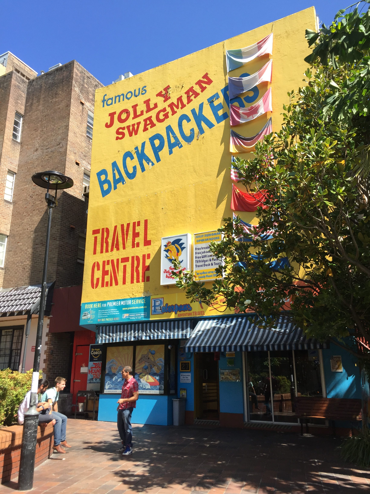

# Mon nouveau chez moi

Voici mon nouveau pied-à-terre : une auberge de jeunesse riche en couleurs et en nationalités. Vous pouvez vous fier aux drapeaux en façade : j'y ai trouvé au moins un ressortissant de chaque drapeau. Italie, France, Canada, Allemagne, États-Unis, Chine, Royaume-Uni et Suède. Mais pas que...

On m'avait prévenu sur Sydney : la population française est très bien représentée. L'auberge n'échappe pas à la règle avec une France majoritaire, suivie de près par l'Allemagne. D'ailleurs, la nationalité française est une chose ; la francophonie en est une autre. Quand ce ne sont pas des belges ou des canadiens qui parlent leur langue officielle, on tombe sur des italiens ou des allemands qui maîtrisent également la langue de Molière. Ce n'est pas comme ça que je deviendrais rapidement bilingue...