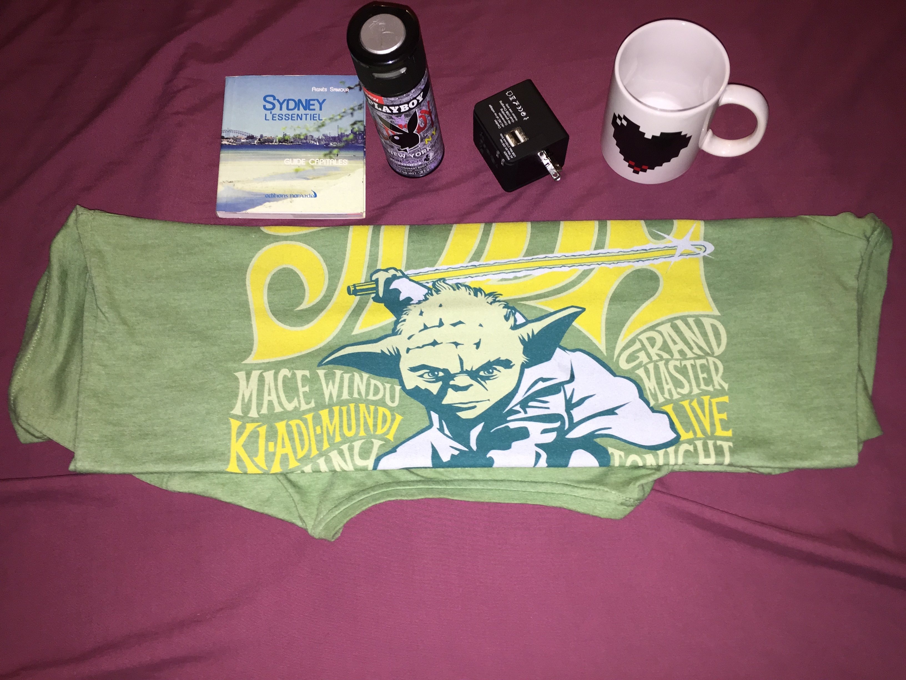

# Le tout est d'être bien équipé/entouré

J'ai la chance d'avoir des copains qui m'ont bien gâté avant mon départ. En plus d'être des cadeaux sympas et agréables, ils s'avèrent indispensables. J'ai nommé :
- Sydney - L'essentiel : petit guide sur la plus grande ville australienne et qui regorge de bons plans (ciné, balades, restos...)
- Le déodorant Playboy : pourquoi Playboy ? Faut demander à la personne qui me l'a offert, mais quoiqu'il en soit, ça reste indispensable.
- L'adapteur-secteur multi-pays : je ne vais qu'en Australie, mais avoir la possibilité de se brancher aux États-Unis, à l'Europe et à l'Asie ne peut être qu'un plus.
- La tasse qui change de couleur quand elle est chaude : c'est peut-être pour ça que le thé y est meilleur ^^
- Le t-shirt Yoda : trop grand pour être porté en journée, il fait un excellent pyjama ; mais la vraie plus-value est qu'il a attiré l'attention d'un instructeur de Yoga qui était de passage à l'auberge et avec lequel j'ai pu bénéficier de plusieurs mois de séances gratuites ;)