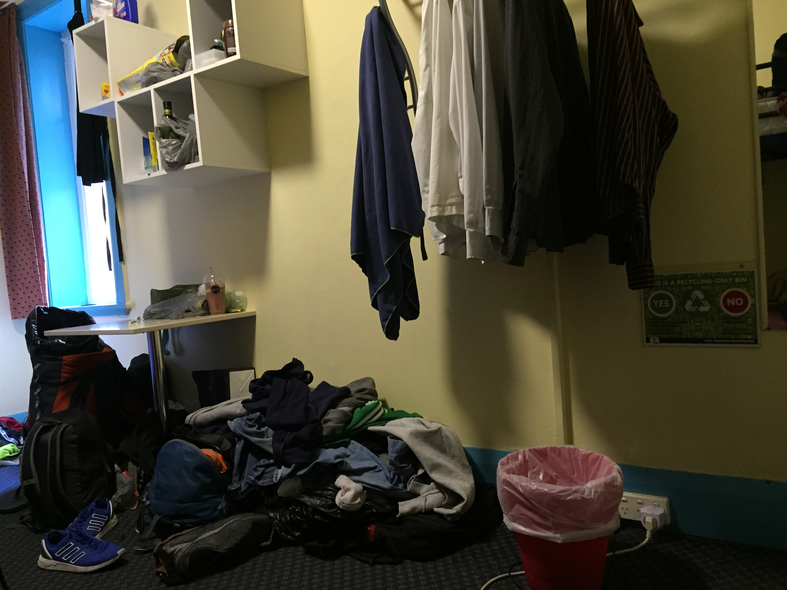

# La vie en communauté

La dernière fois que j'ai vécu avec des gens sous le même toi remonte à... Chez mes parents !
Autant dire que la vie en dortoir (que 3 autres camarades de chambrée pour moi - certains en ont 6) apporte son lot de surprises.
Comme vous pouvez le constater, on peut se retrouver dans une chambre avec des vêtements sur le sol. Probablement pour rembourrer la moquette trop fine...
Sinon, au moment de sécher son linge on peut constater l'oubli d'un string sur la poignée du sèche-linge ^^

Mais à part ça, le plus dur reste la gestion du sommeil. Car les entrées et sorties de la chambre à toute heure du jour ou de la nuit, avec une porte qui claque... Ça réapprend à faire la sieste !
Mais ne boudons pas notre plaisir. Avoir des camarades de chambre, c'est agréable et ça fait de la compagnie. Le partage est roi : bonbons, chips, bières... Le régime parfait pour garder la ligne !

