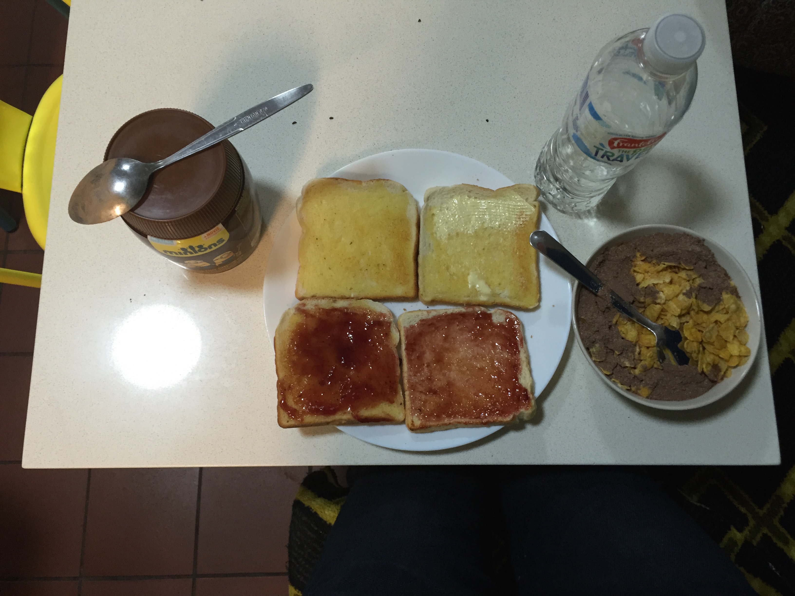

# Comment être sûr que je sois debout avant 9h ?

Avec un petit déjeuner gratuit bien sûr ! L'auberge en offre un très rudimentaire (toasts, beurre, confitures et céréales basiques) à tous ceux qui ont le courage de descendre avant 9h. Il n'en fallait pas plus pour me motiver. J'ai même acheté du chocolat en poudre afin d'avoir un vrai chocolat chaud plutôt qu'un simple bol de céréales au lait froid...