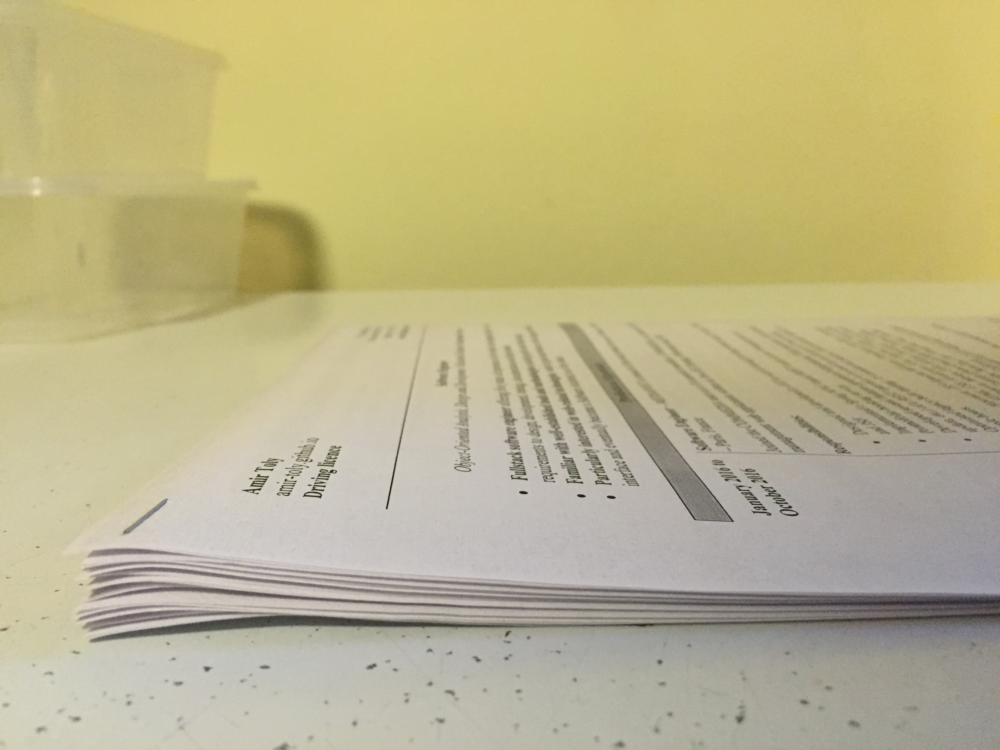

# À moi les agences d'intérim

Après quelques appels non concluants, je décide de passer à la vitesse supérieure en consacrant toute une journée à la distribution de mon CV dans les principales agences de recrutement.

Comment j'en suis arrivé là ? Bien que sur le papier j'ai tout pour plaire au marché du travail australien, il y a un petit hic qui bloque l'engrenage : mon visa. Le Working Holiday Visa (ou Permis Vacances Travail) ne permet de travailler que 6 mois d'affilée pour le même employeur, ce qui est une durée beaucoup trop courte dans mon domaine. Il faut donc dénicher des missions de 6 mois ou moins, ce qui n'est pas chose aisée. Espérons que ce petit tour des agences portera ces fruits...