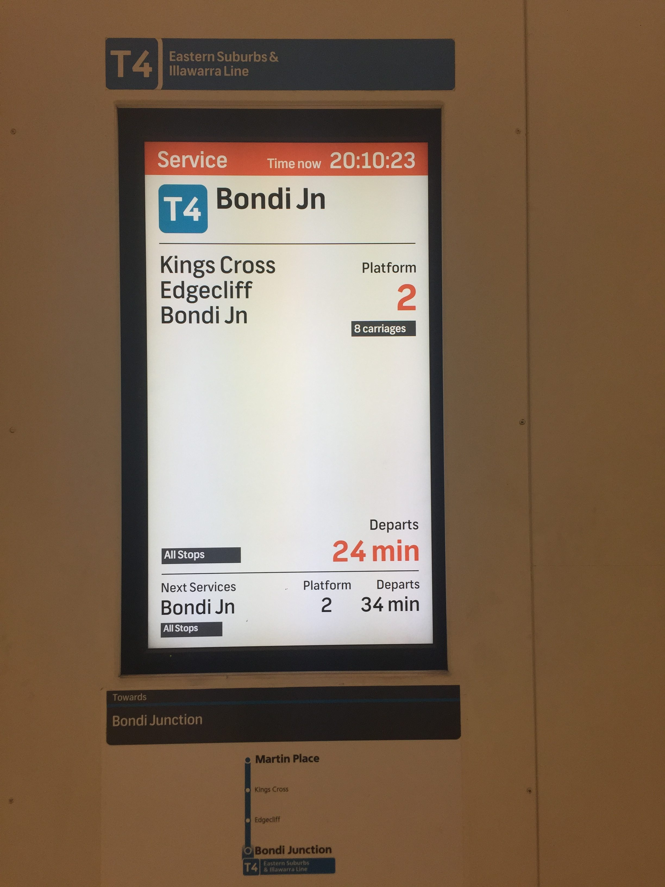
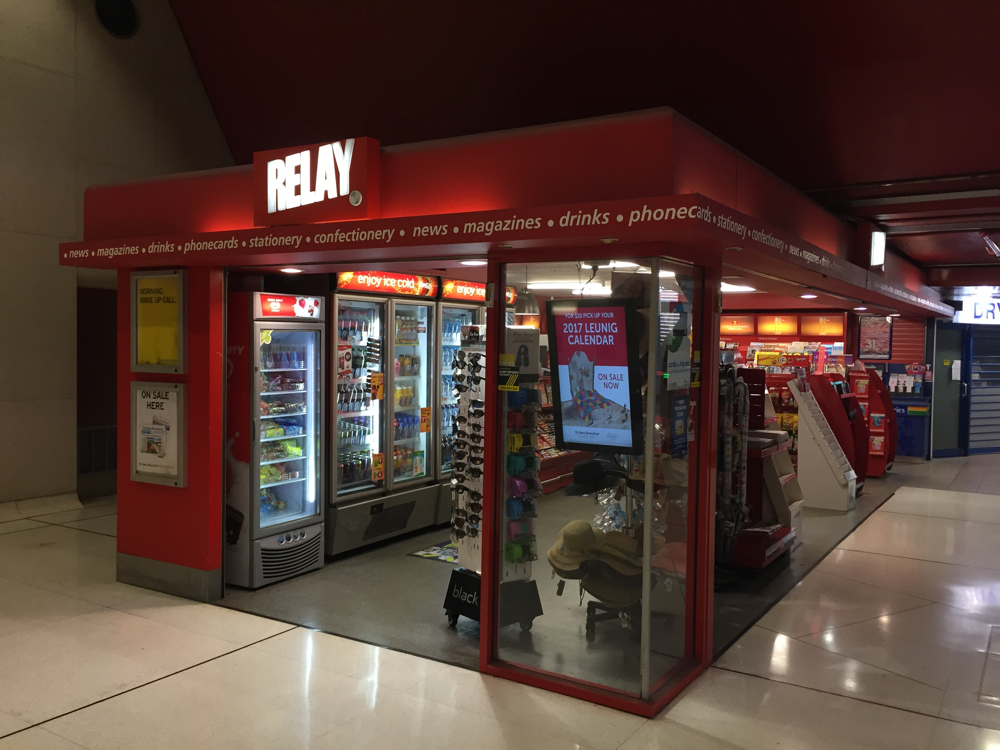

# Les transports ne changent pas

Après près de 2 mois sans aucun soucis dans les trains de banlieue (pas de métro au sens parisien du terme, mais plutôt l'équivalent des RER) de Sydney, je commençais à penser beaucoup de bien d'eux. Eh puis voilà, il fallait que ça arrive ! Plus de 20 minutes d'attente pour un train au lieu des 5-7 minutes habituelles.
Bon, depuis cet incident plus rien. Pas d'avarie matérielle, pas de colis suspect, ni de personnes présentes sur les voies... Pourvu que ça dure.

