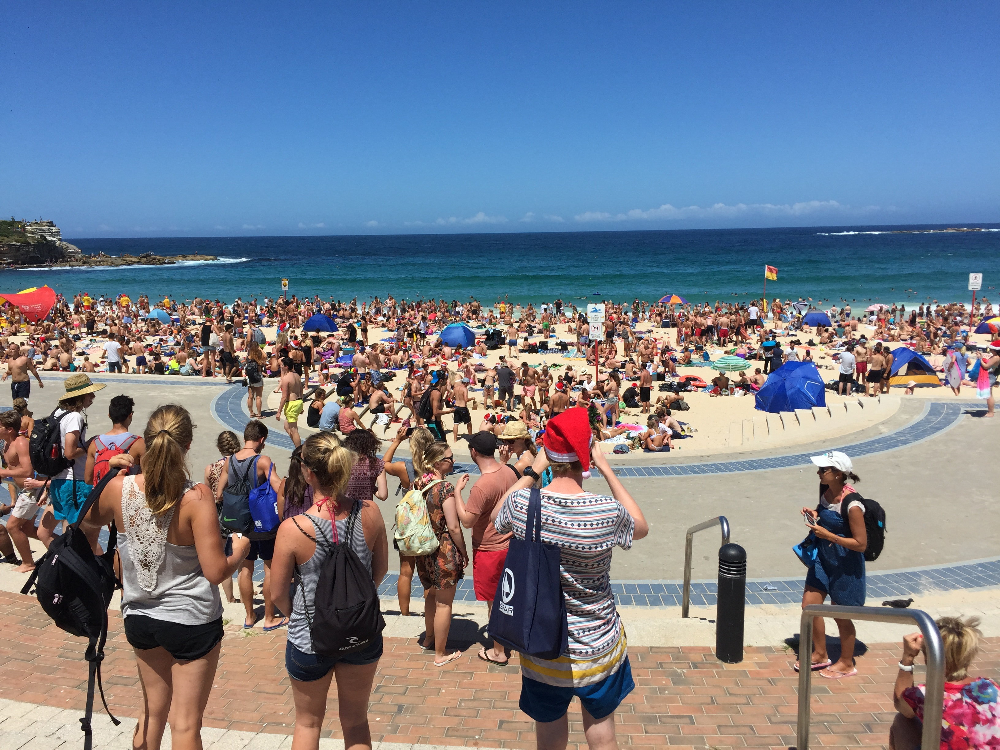
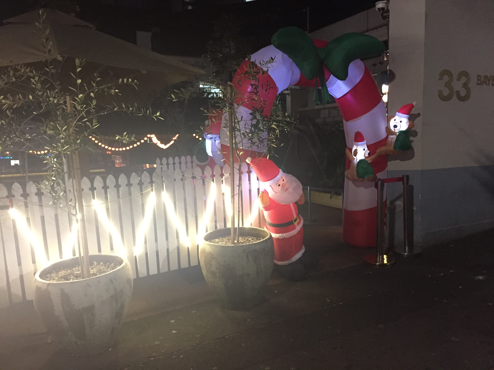
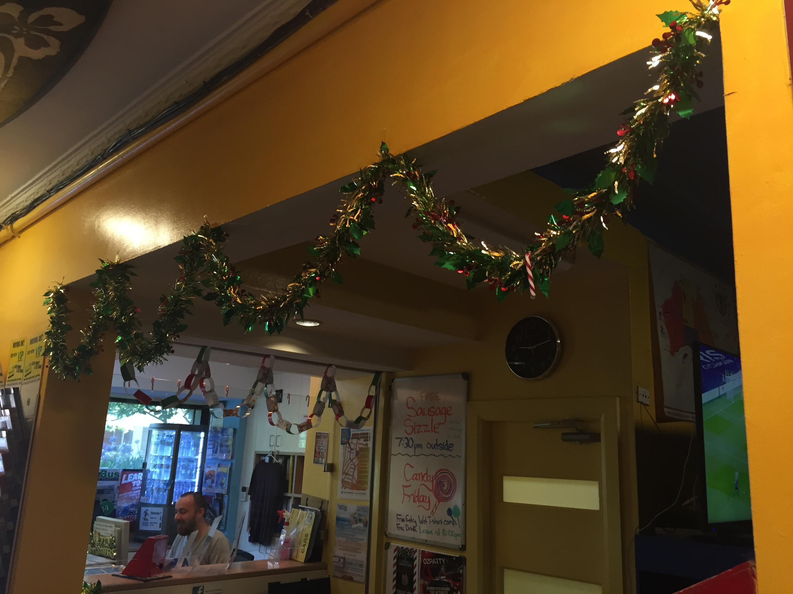
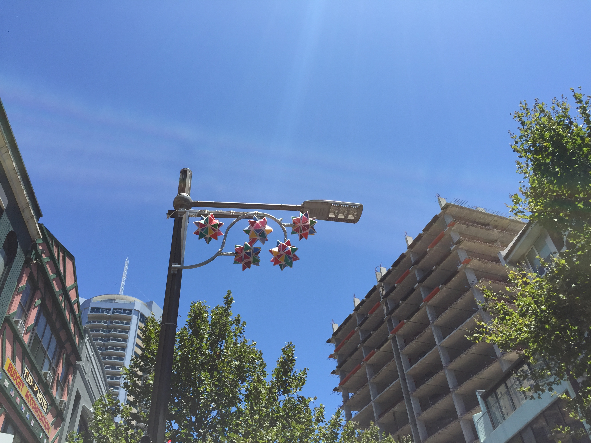
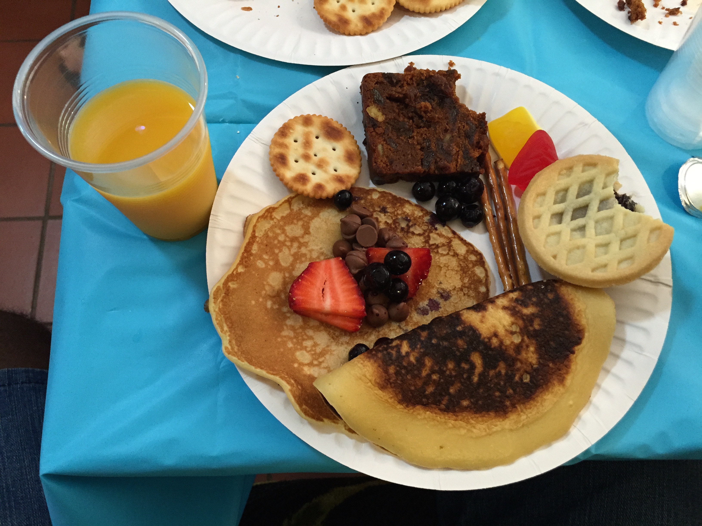

# Noël à Sydney

Première chose : dans l'hémisphère Sud, c'est l'été. Pour certains, Noël par 30 degrés à l'ombre relève du fantasme, mais pour moi qui ai grandi en Guadeloupe, rien de surprenant :D

Des décorations (même hivernales) un peu partout dans la ville, mais aussi dans l'auberge. Aucune idée de s'il s'agit d'une tradition locale ou d'une idée de l'auberge de jeunesse, mais j'ai eu droit à un brunch sucré le matin du 25 décembre. Pas bon pour la santé, mais bon pour le moral.
Enfin, avec un soleil pareil, direction la plage (bondée) pour finir la journée en beauté !

