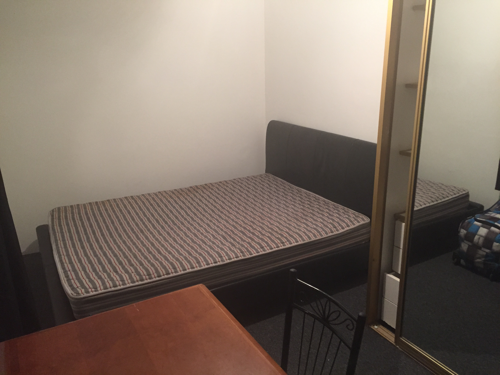
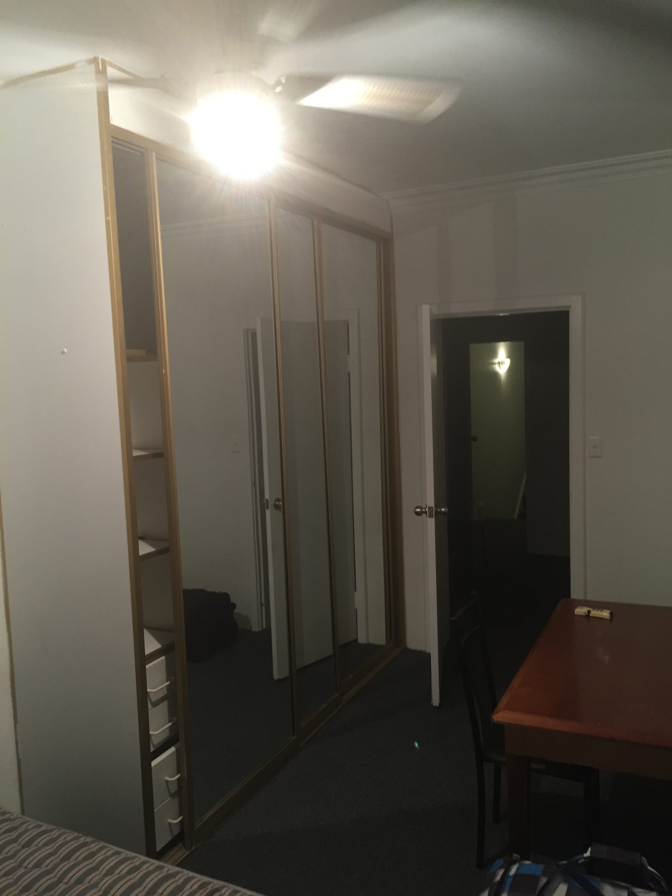
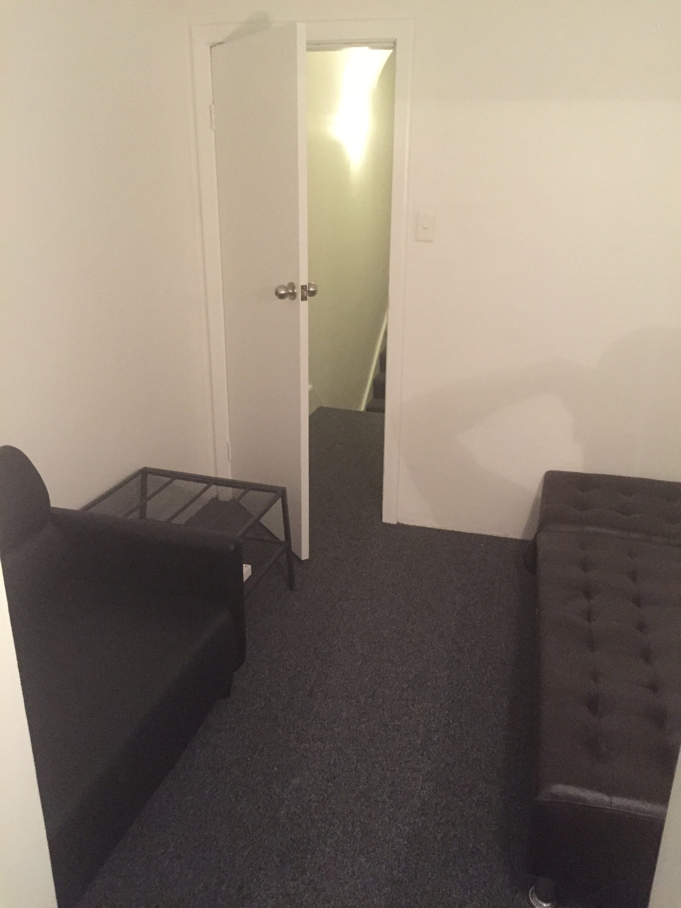

# La collocation, la vraie

Après une première expérience peu glorieuse, j'ai voulu assurer quelques critères avec ma nouvelle collocation. Être plus de 2 résidents, s'assurer de pouvoir faire la lessive à volonté, meublé et charges comprises.
C'est donc avec grand plaisir que je me retrouve dans une petite maison, juste à côté de la gare centrale de Sydney. 4 colocataires : un italien, un colombien et un couple de brésiliens (ouf, pas de français ^^)

Une salle de bain à partager à 4 (le colombien ayant une salle de bain privative), la cuisine, la salle à manger et la salle télé. Tous travaillent... Beaucoup trop, car je ne les vois qu'en soirée, et ce même le week-end.

Une très bonne première impression...

